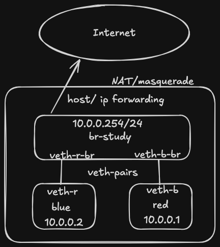

You `docker run`. You get networking. It's that simple. But is it?

Under the hood, [Docker](https://docs.docker.com/engine/network/) creates network namespaces, virtual Ethernet devices, bridges, routing rules and everything else needed for containers to communicate. I'm following [Drew Elliot's Networking Course](https://github.com/drewelliott/kubecraft/tree/main) lessons; the first of which is mostly about how networking happens in containers. What follows is based on the notes I made during the course and revised on my own, including some concepts I wanted to revise.

# Docker Container Automatic Setup

Imagine you create three containers:

```bash
for cont in blue green red; do
    docker run -d --name $cont alpine sleep 1000
done
```

**Docker automatically sets up all the networking for us.**

A Linux bridge called `docker0` is created:
```
ip link show docker0
ip link show master docker0
```
The first command shows the bridge and the second lists the interfaces enslaved to it.

Each container receives its own virtual network interface:
```bash
for cont in blue green red; do
    docker exec $cont ip addr show eth0
done
```

Docker also keeps track of the bridge configuration:
```
docker network inspect bridge
```
This shows, among other things, the containers attached to the bridge and the IP addresses Docker assigned to them.

For example, on my machine `blue` is `172.17.0.3` and `red` is `172.17.0.4`. The containers can communicate directly:
```
docker exec red ping -c 3 172.17.0.3
```

They also have Internet connectivity out of the box:
```
docker exec green ping -c 3 8.8.8.8
```

From a single `docker run`, Docker has already put in place the whole network machinery needed. In the next section we'll build a simpler version of that ourselves.

# Container Networking by Hand

Containers are just Linux processes with some extra isolation mechanisms. That means everything Docker does under the hood is built on top of standard Linux features. Let's recreate a minimal container network.

The network looks like this: two "containers" running in a host (our already familiar `red` and `blue`), where we want to enable communication between themselves and eventually reach the internet.



## Some Concepts

Let's briefly illustrate some concepts that are useful for this networking exercise.

### Network Namespaces

A [network namespace](https://man7.org/linux/man-pages/man7/network_namespaces.7.html) is a Linux kernel feature that provides an isolated network stack. Each namespace has its own network interfaces, routing table, firewall rules and so on. Containers rely on network namespaces to isolate their networking from the host and from each other.

### Linux Bridge

It's a virtual data switch that operates at the Data Link Layer (Layer 2) of the OSI Model. A bridge can typically connect:
- Physical Network Interface Controllers (NICs, e.g. `eth0`).
- Virtual Interfaces (see below).
- Virtual Machines.
A software bridge can be thought as a software Ethernet switch running inside Linux.
### Virtual Ethernet Pair (veth pair)

It's the virtual cabling between the bridge and the container, each of which has a virtual interface. It also operates at the Data Link Layer. Virtual interfaces are created by the kernel and always come in pairs: typically, one end is placed inside a container and the other is attached to the Linux bridge.

### NAT  and Masquerade

Network Address Translation (NAT) modifies IP addresses and/or ports in packets. Typically, NATs are put in place so that devices can communicate beyond private networks. Masquerade is a special form of Source NAT that automatically replaces the packet's source address with the IP address of the outgoing interface. Linux keeps track of these translations so replies can be delivered back to the correct namespace.


## Defining Namespaces, Bridges, Interfaces and Wiring "by Hand"

Now let's create every piece shown in the diagram ourselves.

First create the network namespaces `blue` and `red`, which will play the role of our containers:
```bash
sudo ip netns add blue
sudo ip netns add red
sudo ip netns exec red ip link show
```
`red` links should show only the loopback interface.

Then add a link of type bridge and name `br-study`, bring it up, assign an ip address pointing to the bridge.
```bash
sudo ip link add br-study type bridge
sudo ip link set br-study up
sudo ip addr add 10.0.0.254/24 dev br-study
```

For the `red` namespace:
- Create a veth pair where `veth-r` will live inside the `red` namespace and `veth-r-br` will remain on the bridge.
- Move `veth-r` into the `red` namespace.
- Attach (`enslave`) `veth-r-br` to the bridge.
- Bring up veth `veth-r`.
```bash
sudo ip link add veth-r type veth peer name veth-r-br
sudo ip link set veth-r netns red
sudo ip link set veth-r-br master br-study
sudo ip link set veth-r-br up
```

Inside each namespace, assign an IP address and bring both the interface and the loopback device up.
```bash
sudo ip netns exec red ip addr add 10.0.0.1/24 dev veth-r
sudo ip netns exec red ip link set veth-r up
sudo ip netns exec red ip link set lo up
```

Now we do the same for blue:
```bash
sudo ip link add veth-b type veth peer name veth-b-br
sudo ip link set veth-b netns blue
sudo ip link set veth-b-br master br-study
sudo ip link set veth-b-br up
sudo ip netns exec blue ip addr add 10.0.0.2/24 dev veth-b
sudo ip netns exec blue ip link set veth-b up
sudo ip netns exec blue ip link set lo up
```

We can now test the network:
```bash
sudo ip netns exec red ping -c 3 10.0.0.2
```

## Accessing the Internet

The namespaces cannot reach networks outside their own subnet yet. They only know about the directly connected network (`10.0.0.0/24`) and have no default route for everything else; we can see that with:
```bash
sudo ip netns exec blue ip route
# 10.0.0.0/24 dev veth-b proto kernel scope link src 10.0.0.2
```

The default route for the machine is:
```bash
ip route show default
# default via 192.168.1.1 dev enp0s25 proto dhcp src <your-ip> metric 100
```

Configure the bridge IP (`10.0.0.254`) as the default gateway for both namespaces:
```bash
sudo ip netns exec blue ip route add default via 10.0.0.254
sudo ip netns exec red ip route add default via 10.0.0.254
```

Allow packet forwarding in the Linux kernel by setting the corresponding parameter to true (i.e. Linux can act as a router):
```bash
sudo sysctl -w net.ipv4.ip_forward=1
```

Define iptables rules to accept forward requests (input and output) for `br-study`:
```bash
sudo iptables -A FORWARD -i br-study -j ACCEPT
sudo iptables -A FORWARD -o br-study -j ACCEPT
```

Then a rule that defines the NAT and Masquerade:
```bash
sudo iptables -t nat -A POSTROUTING -s 10.0.0.0/24 -o enp0s25 -j MASQUERADE
```

Here
- `-t nat`: type NAT
- `-A POSTROUTING`: Apply the rule after the kernel has decided where the packet will leave the host.
- `-s 10.0.0.0/24`: Source is network identifier with mask

And now the namespaces/containers can reach the internet.
```bash
sudo ip netns exec red ping -c 3 8.8.8.8
```

---

Once you take a detailed look at it, you realize that Docker combines and automates a bunch of Linux networking features that we often take for granted. That's why I believe this kind of exercise should be done at least once. The more time we invest in them, the better our mental models become of the foundations behind the tools we use every day as IT engineers. In my opinion, there's a significant difference between repeating "containers are just Linux" and actually getting your hands dirty with namespaces, system resources, routing, and so on. The latter gives you a problem-solving advantage that the former never will.
